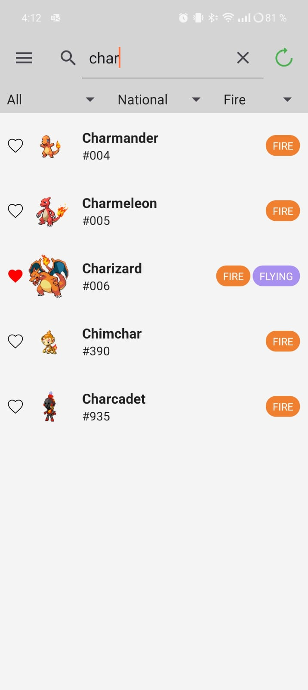

### Pokedex

An Android application that brings the world of Pokémon to your device! With user authentication, an extensive Pokémon catalog, and a favorites feature, this app combines intuitive design with robust technology to deliver a seamless Pokémon experience.

#### Main Features
- **User Authentication**: Secure login with both email/password and Google Sign-In.
- **PokeAPI Data Fetching**: Fetch and browse the entire Pokémon lineup from the PokeAPI, with local DB caching for fast access.
- **Pokemon List**: Explore all available Pokémon, with customizable filters to find your favorites.
- **Favorites**: Mark Pokémon as favorites, saving them to your account for easy access across devices.
- **Dark Mode**: Toggle between light and dark themes to match your preferences.

#### Screenshots
<table>
  <tr>
    <td></td>
    <td></td>
    <td></td>
  </tr>
  <tr>
    <td></td>
    <td></td>
    <td></td>
  </tr>
</table>

#### Libraries Used

- **Firebase Libraries**:
  - Firebase Authentication: Provides secure user login with both email/password and Google options.
  - Firebase Realtime Database: Stores user-specific data like favorites, syncing across devices.

- **Networking Libraries**:
  - Retrofit: Makes API calls to retrieve data from PokeAPI.

- **Image Loading Library**:
  - Glide: Efficiently loads and caches images of Pokémon for a smooth UI

- **Local Data Storage**:
  - Room Database: Caches Pokémon data locally for quick access and offline support

- **Google Play Services**:
  - Google Sign-In: Supports easy and secure Google login